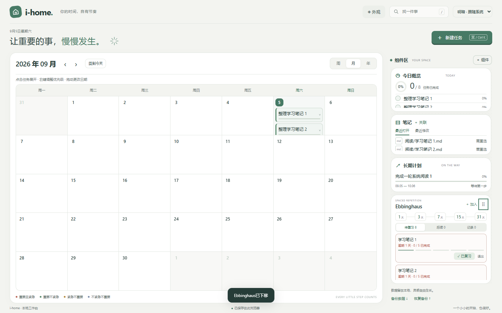

# i-home

一个安静、可组合的 Obsidian 时间主页，把任务、日历、笔记、复习节奏与学期规划放在同一张画布里。



## 它能做什么

- **周、月、年三种日历**：在不同时间尺度之间切换，任务卡片会自然变成圆点，再从圆点展开为卡片。
- **原位展开任务**：直接在月历中查看和完成子任务，无需跳出当前日期。
- **可搭建的组件区**：自由启用、隐藏和排序今日概览、最近笔记、长期计划与 Ebbinghaus。
- **Ebbinghaus 复习**：按 1、3、7、15、31 天安排 Markdown 笔记复习，以每次实际完成日期计算下一次复习。
- **Markdown 关联**：任务可以连接当前 Vault 中的 Markdown，笔记改名或移动后路径自动同步。
- **课构 CourseCraft**：按学期组织培养方案与课程包，将教学班拖入未来周课表，再按日期范围应用到 i-home。
- **课程表导入**：也可以直接在本地解析 XLSX 课表，在周视图中排课、拖动任务并调整持续节数。
- **四套外观与明暗模式**：澄光、纸间、夜航、森息均支持浅色、深色和跟随 Obsidian。
- **本地优先**：任务、计划和复习记录保存在插件自己的 `data.json`，不上传笔记正文。

## 安装

### 从 Release 安装

1. 在 GitHub 的 **Releases** 页面下载 `i-home-1.1.0.zip`。
2. 解压后，将其中的 `i-home` 文件夹放到你的 Vault：

   ```text
   <你的 Vault>/.obsidian/plugins/i-home/
   ```

3. 确认目录中直接包含 `main.js`、`manifest.json` 和 `styles.css`。
4. 打开 Obsidian → 设置 → 第三方插件，刷新并启用 **i-home**。

升级时替换插件文件即可，请保留原有 `data.json`。

## 开始使用

启用后，i-home 默认在 Obsidian 启动时打开，并复用已有的主页标签。你也可以点击左侧的主页图标，或在命令面板运行 **i-home: 打开主页**。

如果不希望自动打开，可前往 **设置 → i-home → 启动时打开 i-home** 关闭。

### 任务与日历

- 点击月历任务，原位展开子任务；再次点击、点击空白区域或按 `Esc` 收起。
- 右键任务调整重要度与紧急度。
- 在月历中拖动任务更改日期；在周视图中拖入时间格排期，拖动底部调整节数。
- 按 `Ctrl/Cmd + K` 新建任务，按 `Ctrl/Cmd + Z` 撤销最近一次操作。
- 按 `/` 搜索任务、计划和笔记。

### 关联 Markdown

展开任务后点击 **关联 Markdown 笔记**，即可搜索当前 Vault 中的文件。点击关联路径会直接打开原笔记；同名文件以完整相对路径区分。

i-home 不读取或保存笔记正文。文件或文件夹改名时，任务关联和复习记录会同步更新；删除笔记不会删除任务。

### 课构 CourseCraft

切换到周视图，点击 **课构 CourseCraft** 进入未来课表规划器。它将培养方案中的推荐课程、实际教学班和你的学期排课分开管理：

1. 选择要规划的学期。
2. 导入培养方案映射，查看该学期建议修读的课程。
3. 导入 JSON、CSV 或 XLSX 课程包；导入前可以逐门审视和排除。
4. 从课程仓库选择教学班，拖入或点击高亮时间格完成排课；短学期课程放入独立清单。
5. 点击 **应用到 i-home**，填写生效与结束日期，将当前学期写入周课表。

规划器会保存课程仓库、学期安排和应用记录，也支持导出规划 JSON。内置方案仅作为可编辑的起点，可以导入自己的培养方案替换。

### Ebbinghaus

从 **组件区 → ＋ 组件** 启用 Ebbinghaus。组件中的 **＋ 加入** 可以选择已有 Markdown，也可以通过命令面板或文件右键菜单加入当前笔记。

复习节奏为：

```text
加入 → 1 天 → 3 天 → 7 天 → 15 天 → 31 天 → 完成
```

逾期内容会保留在待复习列表中，但不会重复堆积。默认情况下，插件启用后新建的 Markdown 会自动加入；可在设置中关闭。已有笔记不会被批量加入。

### 组件区

点击 **＋ 组件** 选择组件。拖动卡片标题旁的手柄可以排序，也可聚焦手柄后按上下方向键。隐藏组件不会删除其中的数据。

## 数据与隐私

- 所有任务、计划、课程、学期规划、复习进度和界面设置均保存在本地 Vault 的插件数据目录中。
- XLSX 在本地解析，不依赖在线服务。
- Markdown 正文不会写入插件数据，也不会发送到网络。
- 可从主页底部导出或恢复 JSON 备份。恢复前请保留一份当前备份。

## 开发

需要 Node.js 18 或更高版本。

```bash
npm install
npm run build
npm test
```

构建完成后，可安装文件位于 `release/i-home/`。运行时只依赖 Obsidian 和仓库内打包的资源，不需要预览服务器或在线 CDN。

项目最低支持 Obsidian 1.7.2。桌面端已经过自动化界面回归；移动端提供响应式布局，仍欢迎更多真实设备反馈。

## 当前状态

i-home 1.1.0 新增课构 CourseCraft。项目目前尚未提交到 Obsidian 社区插件市场。如遇到问题，请在 GitHub Issues 中附上 Obsidian 版本、操作系统和复现步骤。

## License

[MIT](LICENSE) © 2026 Nanoarcheaum
